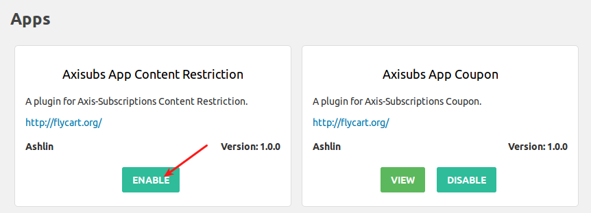
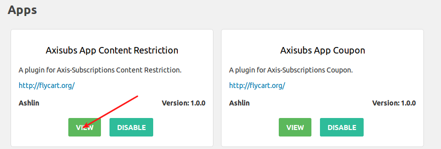
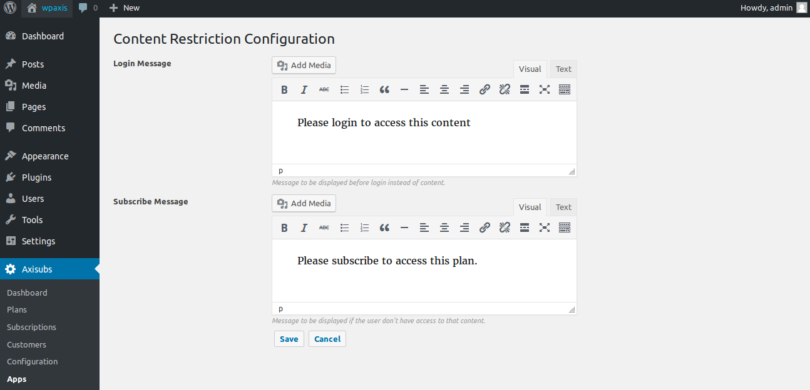
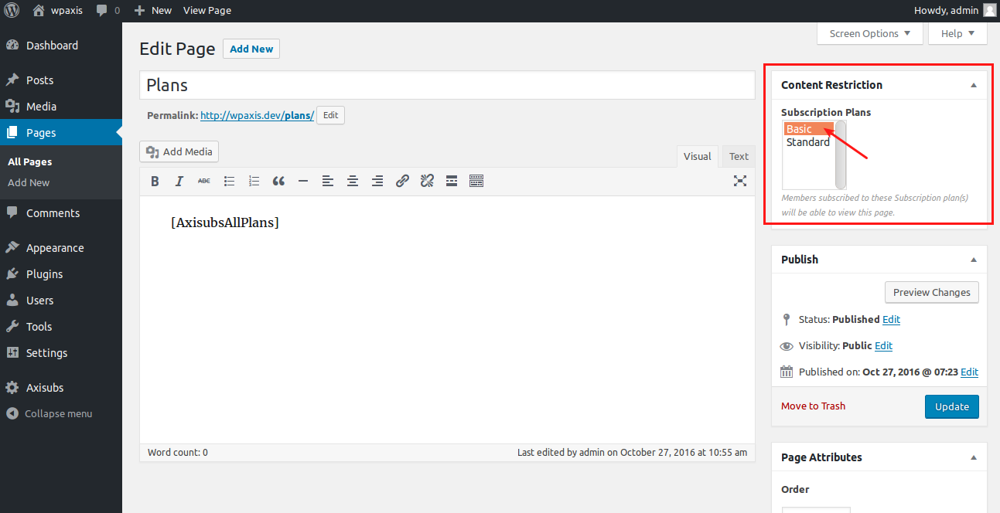
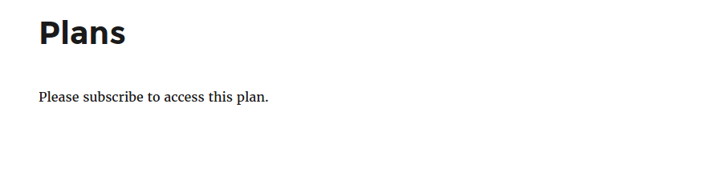
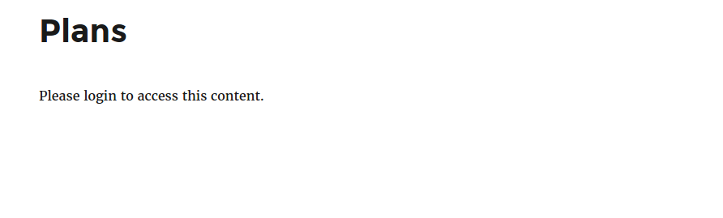

# Content Restriction

## Content Restriction for Axis Subscription

This plugin restricts non registered users to view subscription plans. You can restrict content to registered users only.

If no subscription plans are selected, the page is available to all users whether they are subscribers or not or logged in or not.

If one subscription plan is selected, only users logged in with that subscription level will be able to view the page.

### Follow below instructions to work with content restriction

1. From wordpress dashboard, go to Axisubs > Apps and check if Axisubs App Content Restriction is enabled. If not, click on Enable to activate the app Axisubs App Content Restriction. Once enabled and activated, click on View. 
2. Clicking on view will take you to the Content Restriction Configuration page. In configuration page, you will be having text editors to add custom message. Custom message added here will be displayed when non registered user tries to view the page. Add your custom message here and click save. 
3. Now from wordpress dashboard go to the page where you have actually published your plans. On right side of the page, you will be having Content Restriction panel in that, select the subscription plan. Members subscribed to the subscription plan selected here will be able to view the page. 
4. For example, consider you are having two plans Basic plan and standard plan. If you select Basic subscription plan then registered users who are subscribed to Basic plan will be able to view the page. Otherwise it will show the message "Please subscribe to this plan". For non-registered user, it will show the message "Please login to access this content". 

### Frontend Screens

