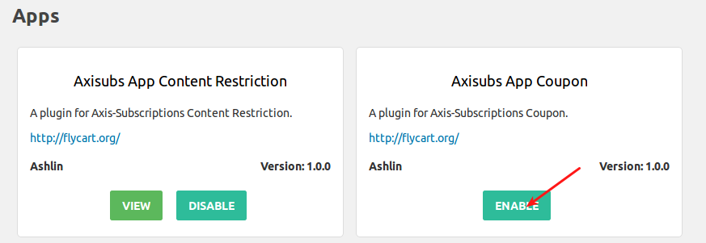
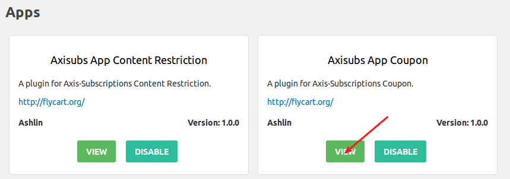
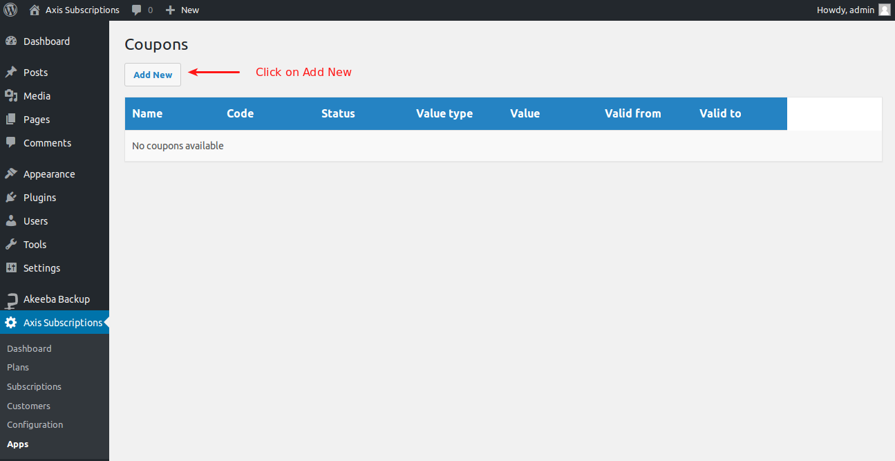
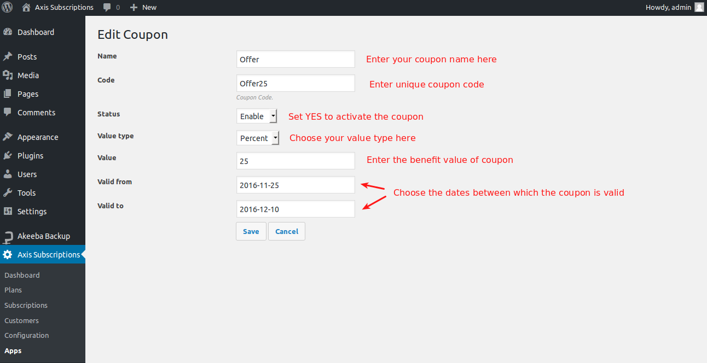
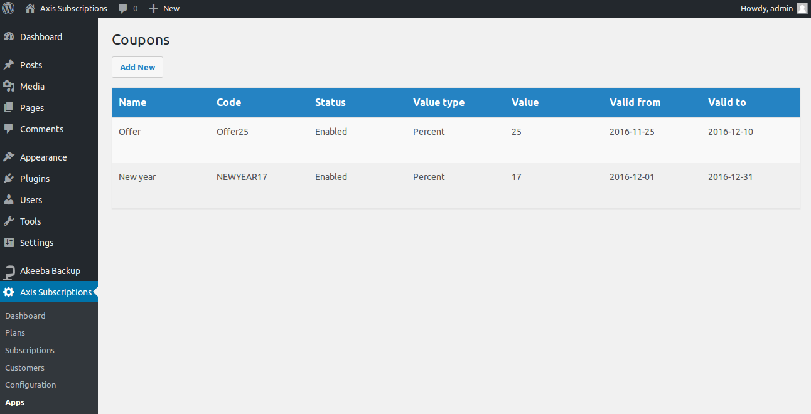
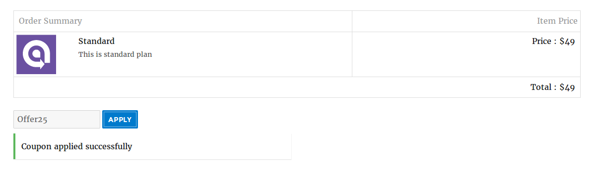
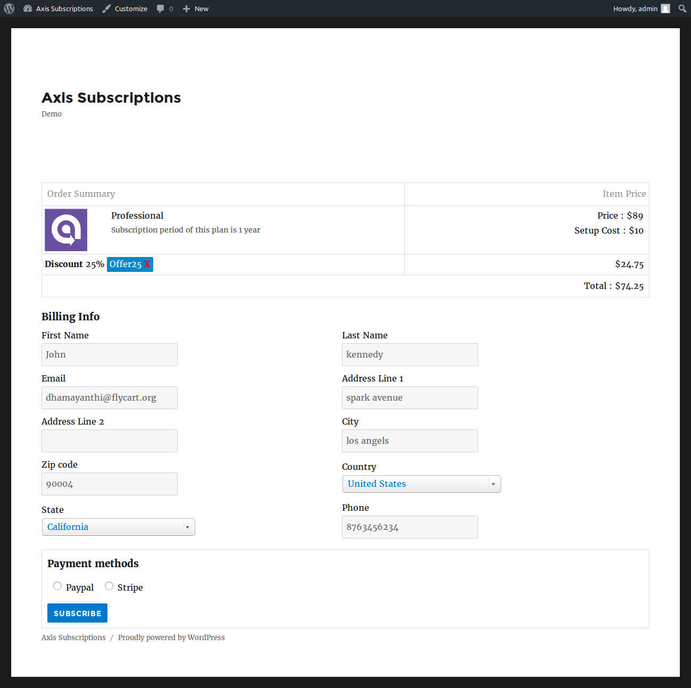

# Coupon

Coupon codes, also known as promo codes or discount codes, that enable customers to shop online with extra privileges.

Follow the instructions below to create coupon code in Axis Subscriptions.

From wordpress dashboard, go to Axisubs > Apps and check if **Axisubs App Coupon** is enabled. If not click on **Enable** to activate the app Axisubs App Coupon.

Once enabled and activated, click on **View**.

Clicking on view will take you to the coupon page where you should click "**Add New**" to create new coupon.

Fill all the basic fields and click save. Refer the below image

**Coupon Name** - Name of the coupon you wish to offer

**Coupon Code** - Unique code assigned to the coupon for the customers to make use of the coupon

**Status** - Set this to 'Yes' to make the coupon available to customers

**Value Type** - Value of the coupon is fixed amount or a specific percentage of the order value

**Value** - Value of the coupon

**Valid from and Valid to** - Set the coupon validation here. Choose the dates between which the coupon is valid.

## Frontend

## Video tutorial

Watch below video tutorial and see how it works

[plugin:youtube](https://www.youtube.com/watch?v=yoMfLNx5dM0)
