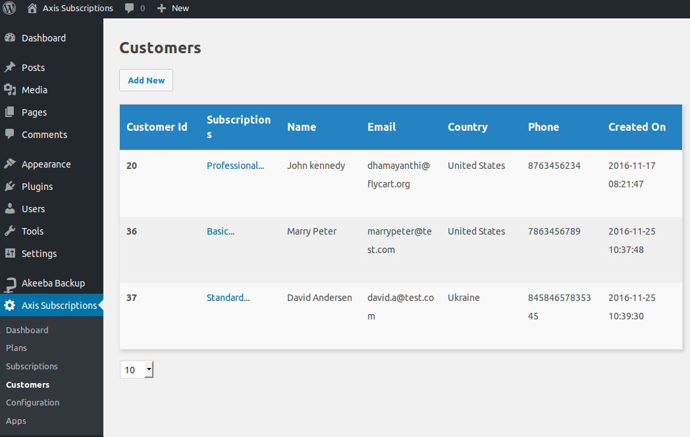

# Customers

Customers are those who subscribes for plan from your subscription system. Whoever subscribe successfully is added as a customer in Axis subscription. Check the below image,

You can also create new customer manually by click on **Add new** button on top left of this page.
