# Getting Started

## Welcome to Axisubs

Axis Subscription is the flexible and modern subscription billing management system developed for Wordpress Content Management System. It is very similar to normal subscription component but there are a few key differences which you need to keep in mind. Following steps will explain you briefly on how to get started with our Axis Subscription.

- **[Installation](#installation)**
- **[Configuration](#configuration)**
- **[Creating plan](#creating_plan)**
- **[Frontend Demo](#frontend_demo)**

### Step 1 Installation

In your Wordpress Dashboard, go to Plugins > Add new as illustrated below.

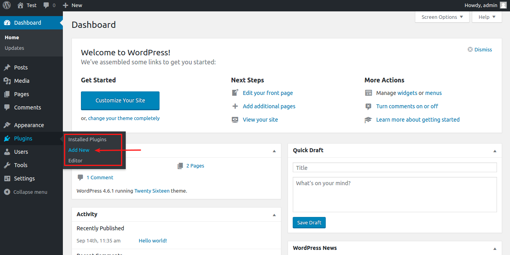

Click on Add new will be redirected to the plugin installer page. 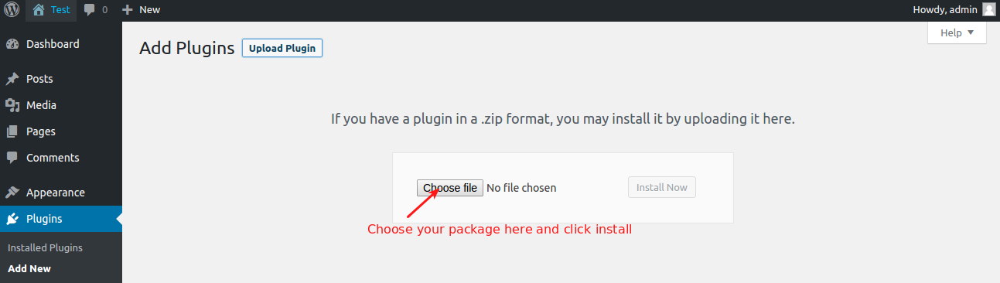

Select the package file and click **Install** 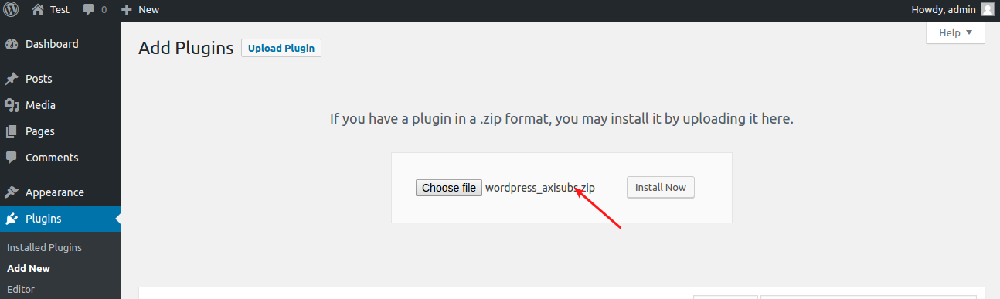

After installing plugin, go to Plugins > Installed Plugins and find the Axisubs plugin and click on **Activate** to activate the Axisubs.

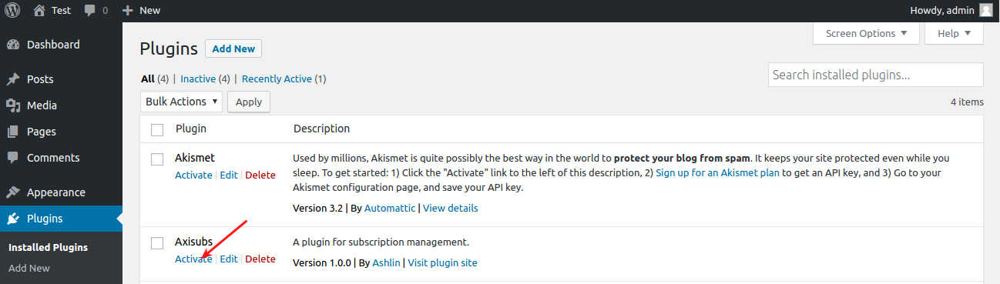

Once you activated, the Axisubs will be listed in the Wordpress Dashbord menu as like illustrated image below 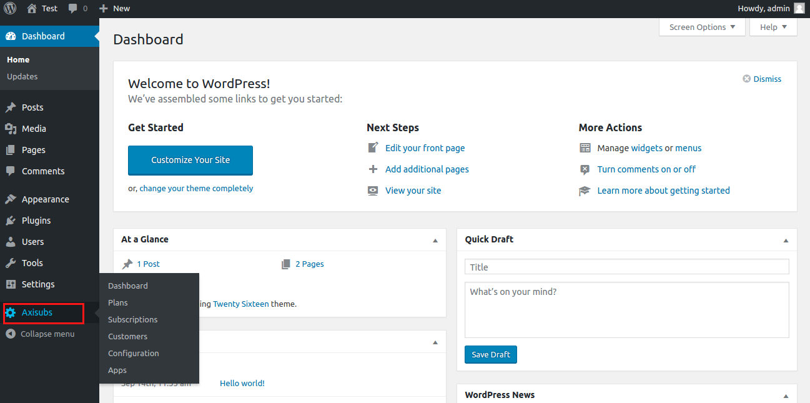

### Step 2 Configuration

Now you are ready to configure the Axis subscription. Go to Axisubs > Configuration to configure the basic settings of Axis subscription management system. 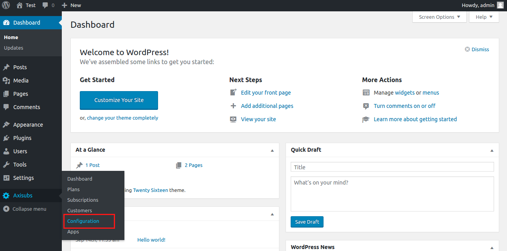

On clicking Axisubs > Configuration, you will be redirected to configuration page where you should fill all the fields and click **Save**

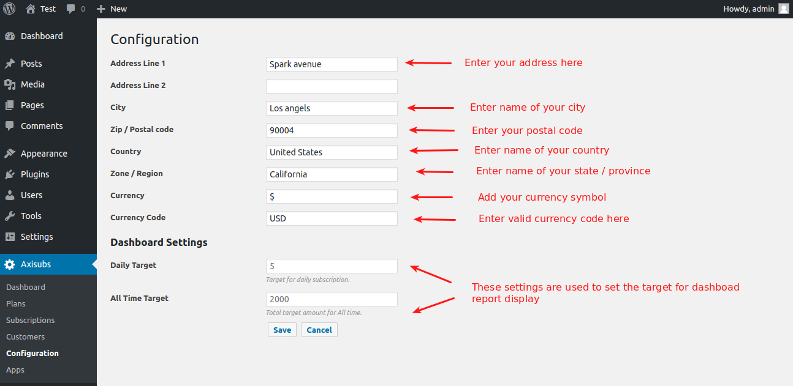

### Step 3 Creating Plan

With Axis subscription management system, you can create 5 types of plan such as Free, Non-recurring, Non-recurring with trial, Recurring, Recurring with trial.

From Wordpress Dashboard go to Axisubs > Plans and click on **Add new** to create new plan. 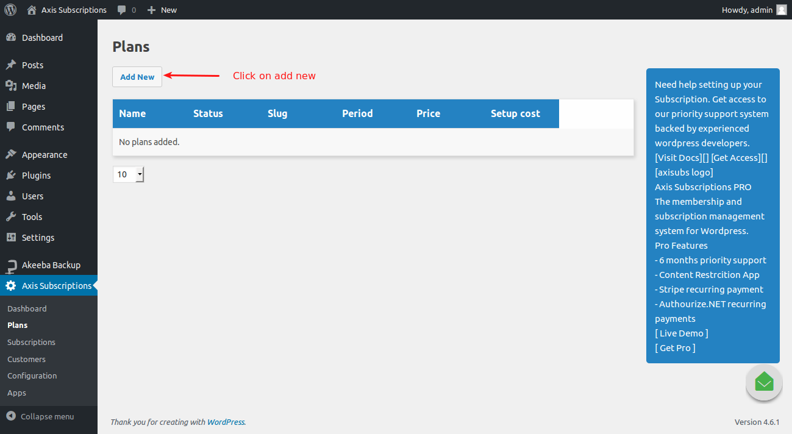

Clicking on **Add new** will redirect you to new plan creating page where your should enter all the fields required for your plan and click save. 

### Display Plan in frontend

Once you created the plan, you can display it using shortcode. Go to Pages > Add new to create new page.

Add the below shortcode in your page content. The following shortcode will display all the plans you have created. Shortocde - **[AxisubsAllPlans]**

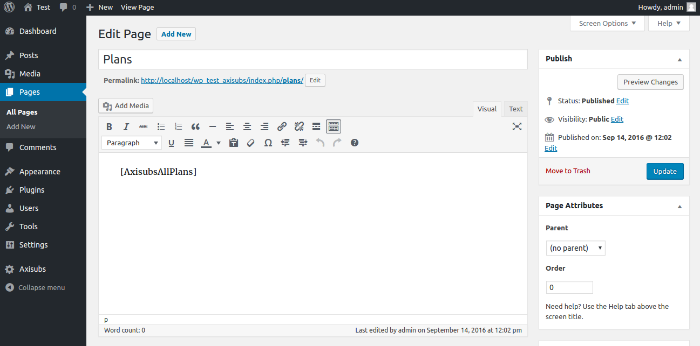

### Frontend Demo

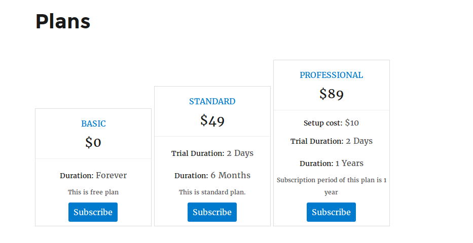 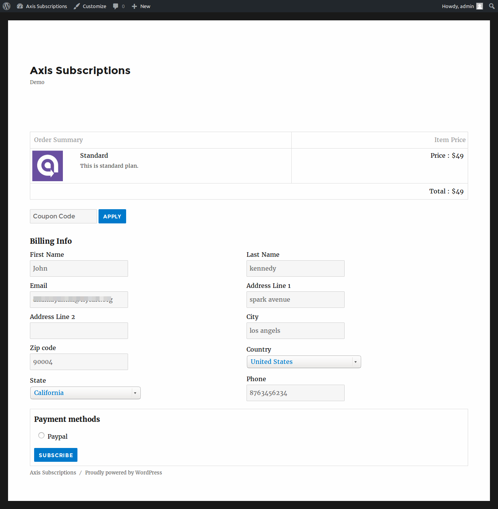 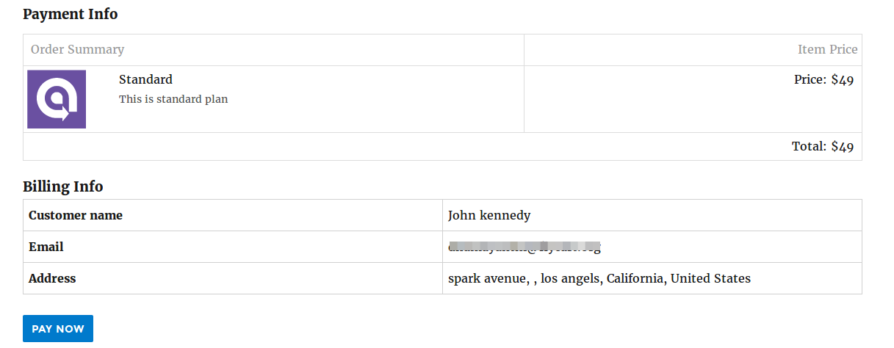 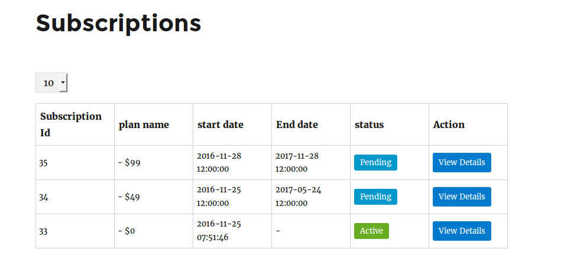
