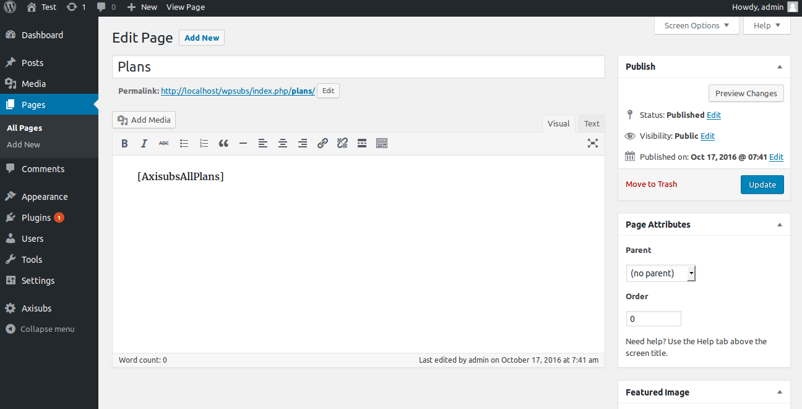
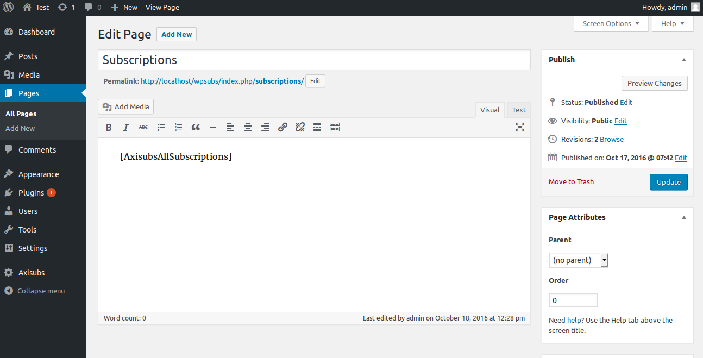
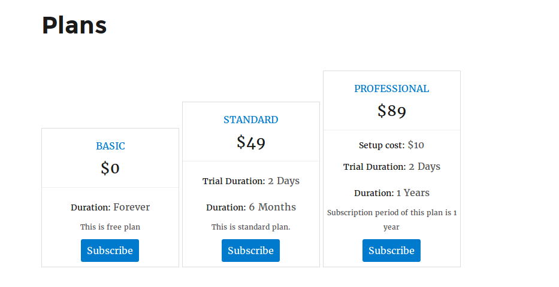
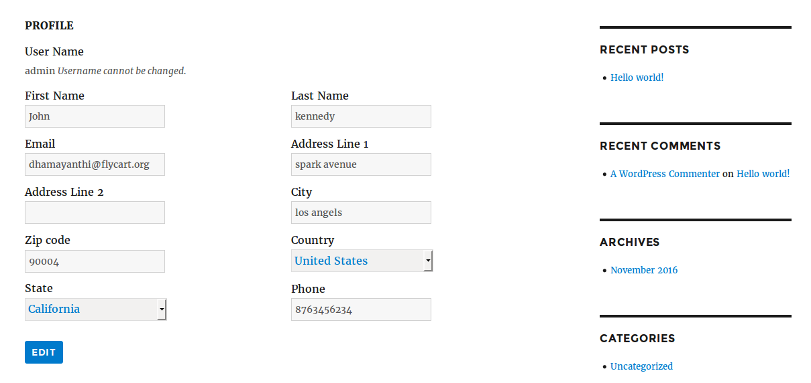

# Frontend pages

Axis subscription let you create pages for displaying plans, user profile, subscription details with the help of shortcodes. You find the below shortcodes in Axis subscription dashboard page.

- [AxisubsAllPlans] - Helps to load all Plans
- [AxisubsAllSubscriptions] - Helps to load users(own) Subscriptions
- [AxisubsMyProfile] - Helps to load user profile

## Create page to display plans

1. Click on Pages tab from wordpress dashboard and **Add New**.
2. Enter the page title. For example, **Plans**.
3. Add this shortcode [AxisubsAllPlans] inside page editor and save.

## Create page for user profile

1. Click on Pages tab from wordpress dashboard and **Add New**.
2. Enter the page title. For example, **Profile**.
3. Add this shortcode [AxisubsMyProfile] inside page editor and save.

## Create page to display users subscriptions

1. Click on Pages tab from wordpress dashboard and **Add New**.
2. Enter the page title. For example, **Subscriptions**.
3. Add this shortcode [AxisubsAllSubscriptions] inside page editor and save.

## Frontend

