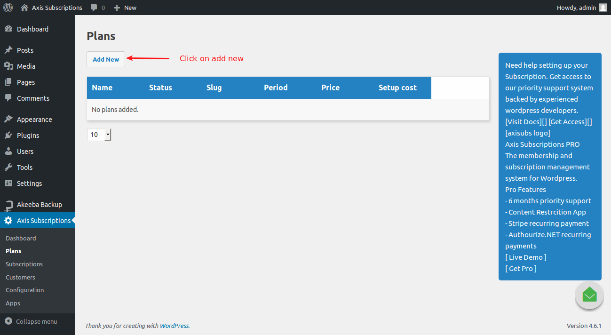
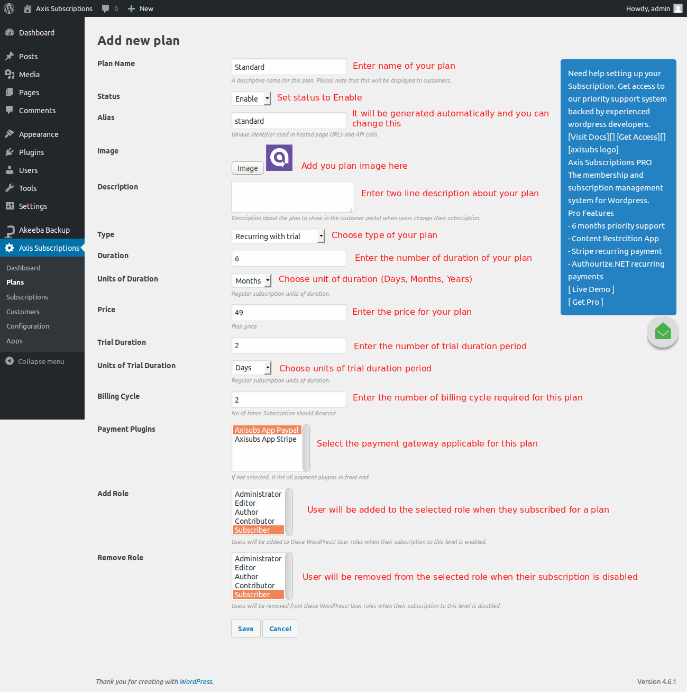
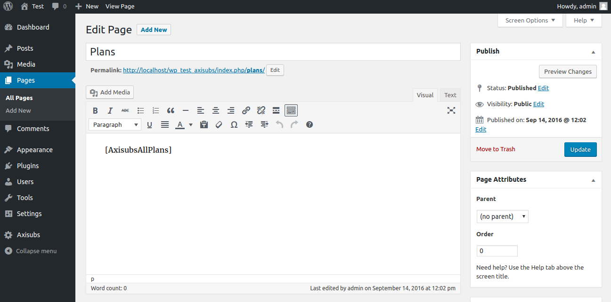
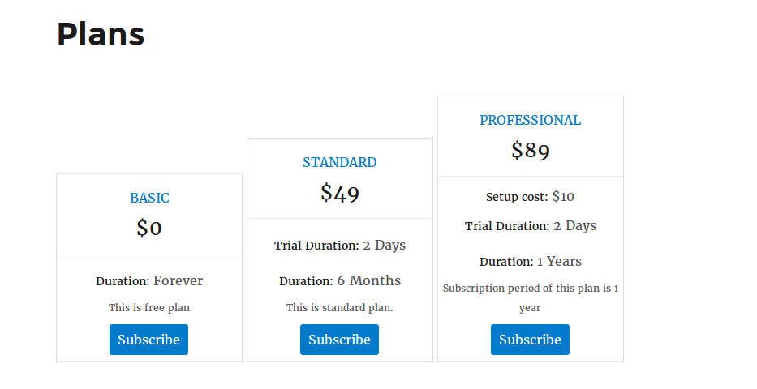

# Plans

## Creating plans in Axis subscription

With Axis subscription management system, you can create 5 types of plan such as Free, Non-recurring, Non-recurring with trial, Recurring, Recurring with trial. Types of plans are explained below,

**Free:** When you choose plan type **free**, the price section will be hidden since the plan is supposed to be free there should be no price.

You can set the plan to be free forever or else the duration can be alloted to the free plan. At the end of duration time, the plan **Free** will expire and user needs to subscribe for the plan again.

If you don't want your plan to be free forever, enter the duration period in number and choose the duration units (days, weeks, months, years). 

**Non-recurring:** If you choose non-recurring plan type, the subscriber cannot auto renewal his subscription plan. Subscriber will have to subscribe for the plan next time. Here you can set the duration period of the plan and price for the plan. You can also add the one time set up cost to the price of the plan.

For example, Price: $39 Setup cost: $10 Duration: 6 months

**Non-recurring with trial:** With this plan type, you can offer the trial period for the plan. To do this, you can define the trial period duration. Once the trial period completed, the subscription plan will be activated.

**Recurring:** It is nothing but auto-renewal. If you choose non-recurring plan type, the subscriber can auto renewal his subscription plan. You can define the number of auto renewal for this plan. That is, number of times Subscription should Reoccur. See below image, 

**Recurring with trial:** With this plan type, you can offer the trial period for the recurring plan. To do this, you can define the trial period duration in days or weeks or months or years. Once the trial period completed, the subscription plan will be activated.

## Creating new plan

From Wordpress Dashboard go to Axisubs > Plans and click on **Add new** to create new plan. 

Clicking on **Add new** will redirect you to new plan creating page where you should enter all the fields required for your plan and click save.

**Plan name:** Enter the name of your plan.

**Status:** Choose **Enable** to activate the plan.

**Alias:** This will be generated automatically by axis subscription. You can also change this.

**Description:** The optional content entered here will be displayed as description of the plan. Enter two or three line descirption about your plan.

**Type:** Choose your plan type (Free, Non recurring, Non recurring with trial, Recurring, Recurring with trial)

**Duration:** Enter the duration of your plan in number. For example, 3

**Units of duration:** Choose the duration units (Days, Weeks, Months, Years) from dropdown list. For example, say 3 months.

**Price:** You can enter the price of your plan here.

**Setup cost:** You can define the one time set up cost here. This amount will be added to the price of the plan during payment.

**Billing cycle:** This is used when you choose recurring billing type. For example, if you enter 3, the subscription will occur for 3 times.

**Trial Period:** This option is used when you choose plan types recurring with trial or non-recurring with trial. Here you can enter the period for trial in number. For example, 1

**Units of trial period:** Choose the duration units (Days, Weeks, Months, Years) from dropdown list. For example, say 1 day.

**Add Role:** Users will be added to these WordPress! User roles when their subscription to this level is enabled.

**Remove Role:** Users will be removed from these WordPress! User roles when their subscription to this level is disabled.

## Display your Plans in frontend

Once you created the plan, you can display it using shortcode. Go to Pages > Add new to create new page.

Add the below shortcode in your page content. The following shortcode will display all the plans you have created. Shortocde - **[AxisubsAllPlans]**

## Frontend Demo

