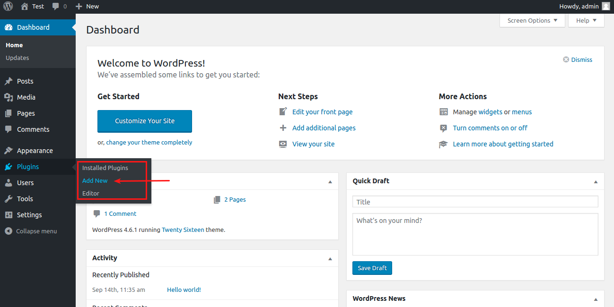
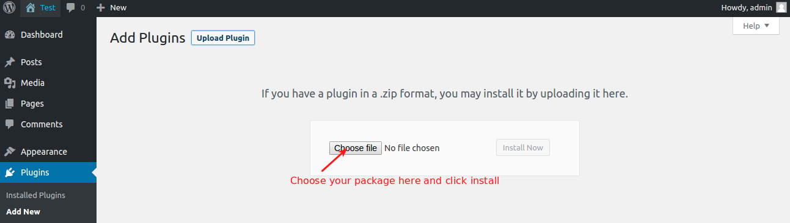
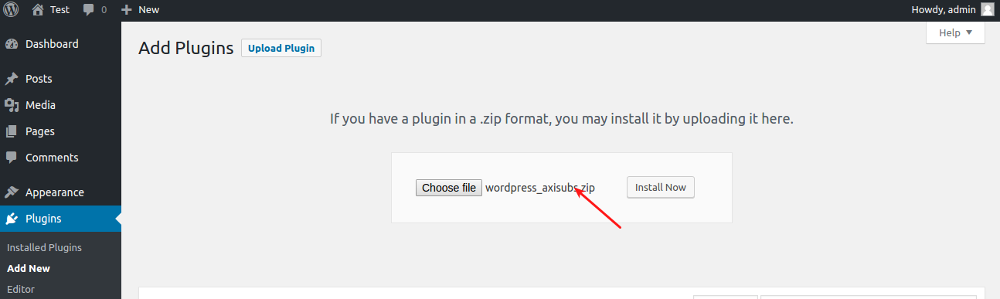
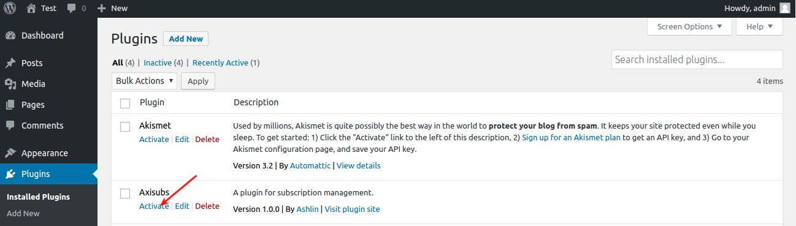

# Requirements

- PHP version 5.6
- Wordpress 4.6.1 or higher

# Installation

In your Wordpress Dashboard, go to Plugins > Add new as illustrated below.

Click on Add new will be redirected to the plugin installer page. 

Select the package file and click **Install** 

After installing plugin, go to Plugins > Installed Plugins and find the Axisubs plugin and click on **Activate** to activate the Axis subscription.

Once you activated, Axis subscription will be listed in the Wordpress Dashbord menu as like illustrated image below 
