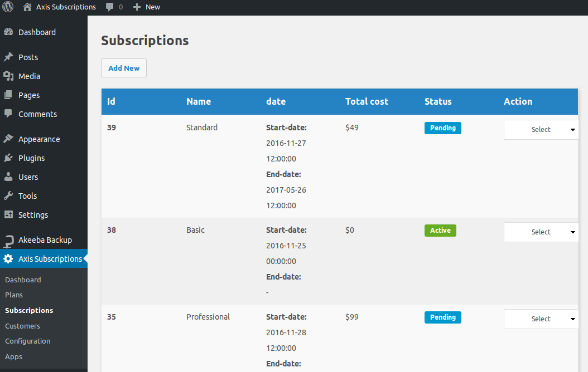

# Subscriptions

A customer views the plans and completes the subscription process, it is transformed into an subscription. Subscriptions are listed here according to their statuses. They are as follows:

- New
- Active
- Cancel
- Pending
- Expired
- In Trial
- Future

Every subscription will possess some important information that explains about it. They are:

- Subscription ID - ID for reference that tracks all the processing steps
- Plan name - Name of the plan to which subscription actually happened.
- Start Date - The date in which the subscription is started
- End Date - The date on which the subscription ends.
- Total Cost - The total value of the subscription after billing
- Status - Active or still in process - like information

Check the image below to understand clearly.  

You can also create the subscriptions manually from backend.

Go to Axisubs > Subscription and click on **Add new** button to create new subscription.
